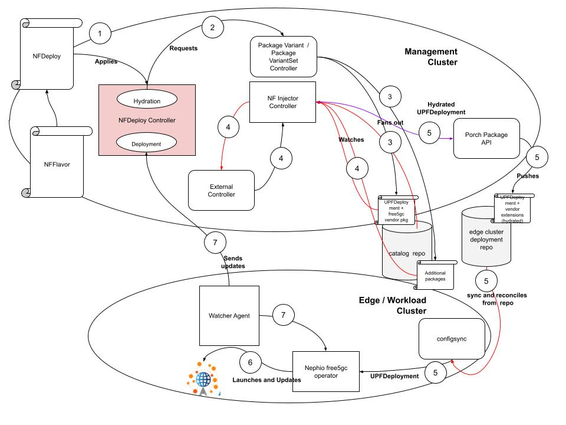

# NFDeploy Controller
NFDeployment controller watches and processes the NFDeployment custom resources. It runs on Nephio's management cluster.

## Description
NFDeployment controller watches and process Nephio's NFDeployment custome resources. It primarily performs the following functions:
1. interprets CRs embedded inside NFDeployment CR
1. fetches corresponding CRs to inject variants
1. tracks and aggregates statuses of each of NF instance's deployment

The following diagram depicts NFDeployment controller's rule in Nephio R1



**NFDeployment**
NFDeployment consists of a deployment unit to track, which includes one or more NF instance, where each instance includes:
- ID
- name of cluster
- NF type (AMF, SMF, UPF)
- NF flavor (user defined, ex: small, medium, large)
- NF vendor
- NF vendor's NF software version
- Connectivities (list of neighbor names, i.e., NFDeploy.Spec.Id)

The high level NFDeployment deployment unit also contains PLMN and overall capacity

On a high level, NFDeployment controller consists of two entities, hydration and deployment:


The hydration entity examines the NFDeployment CR, clones source package based on vendor and version, and clones those packages to a deployment repo based on cluster's name. It primarily interacts with Porch (now), and in the future will primarily interacts with PackageVariant controller.

The deployment entity takes the topology information from NFDeployment CR, and builds a relationship graph to track each individual NF specific status. As part of this entity, NFDeploy controller creates and maintains an instance of EdgeWatcher object with a newly created gRPC server to collect workload cluster selected CRs statuses. The changes in any individual status is reflected on NFDeployment's own status via this deployment entity.

## Getting Started
You’ll need a Kubernetes cluster to run against. You can use [KIND](https://sigs.k8s.io/kind) to get a local cluster for testing, or run against a remote cluster.
**Note:** Your controller will automatically use the current context in your kubeconfig file (i.e. whatever cluster `kubectl cluster-info` shows).

### Running on the cluster
1. Install Instances of Custom Resources:

```sh
kubectl apply -f config/samples/
```

2. Build and push your image to the location specified by `IMG`:
	
```sh
make docker-build docker-push IMG=<some-registry>/nfdeploy:tag
```
	
3. Deploy the controller to the cluster with the image specified by `IMG`:

```sh
make deploy IMG=<some-registry>/nfdeploy:tag
```

### Uninstall CRDs
To delete the CRDs from the cluster:

```sh
make uninstall
```

### Undeploy controller
UnDeploy the controller to the cluster:

```sh
make undeploy
```

## Contributing
// TODO: Add detailed information on how you would like others to contribute to this project

### How it works
This project aims to follow the Kubernetes [Operator pattern](https://kubernetes.io/docs/concepts/extend-kubernetes/operator/)

It uses [Controllers](https://kubernetes.io/docs/concepts/architecture/controller/) 
which provides a reconcile function responsible for synchronizing resources untile the desired state is reached on the cluster 

### Test It Out
1. Install the CRDs into the cluster:

```sh
make install
```

2. Run your controller (this will run in the foreground, so switch to a new terminal if you want to leave it running):

```sh
make run
```

**NOTE:** You can also run this in one step by running: `make install run`

### Modifying the API definitions
If you are editing the API definitions, generate the manifests such as CRs or CRDs using:

```sh
make manifests
```

**NOTE:** Run `make --help` for more information on all potential `make` targets

More information can be found via the [Kubebuilder Documentation](https://book.kubebuilder.io/introduction.html)
