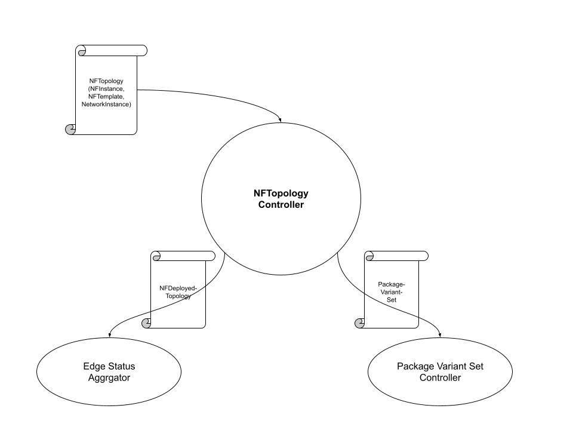
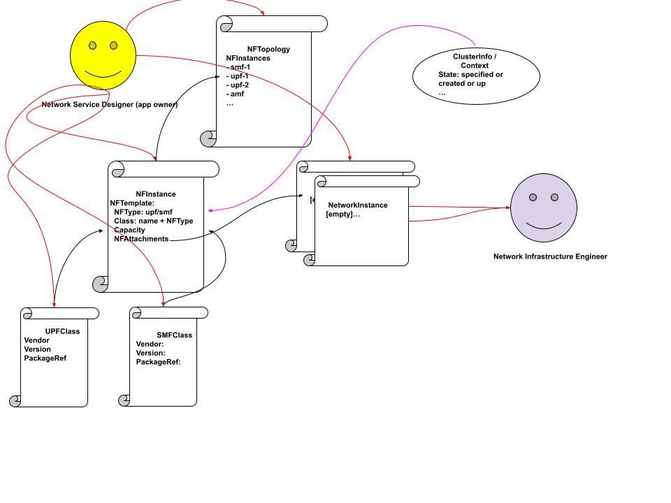

# NFTopology Controller
- Author: @s3wong
- Status: Work-in-Progress
- Approver: 

## Description
NFTopology controller (NTC) takes a network topology centric input and kickstarts the Nephio automation process via generating a PackageVariantSet custom resource, and as the associated packages are being deployed, NTC kickstarts monitoring of continuous statuses updates and aggregation of those statuses via applying a NFDeployedTopology custom resource, which is then processed by the Edge Status Aggregator. NTC also serves as a sample as how entity such as service orchestrator (SO) can integrate with Nephio.



## NFTopology CRD
NTC take an input of a NFTopology custom resource (CR), which has the following definition:

```go
// NFType defines the type of network functions
type NFType string

const (
    NFTypeUPF   NFType = "upf"
    NFTypeSMF   NFType = "smf"
    NFTypeAMF   NFType = "amf"
)

// AMF, SMF, and UPF all have the same structure for its XXXClass for now
type UPFClassSpec struct {
    Vendor      string `json:"vendor,omitempty" yaml:"vendor,omitempty"`
    Version     string `json:"version,omitempty" yaml:"version,omitempty"`
    PackageRef  PackageRevisionReference `json:"packageRef,omitempty" yaml:"packageRef,omitempty"`
}

type NFTemplateSpec struct {
    NFType      NFType `json:"nfType,omitempty" yaml:"nfType,omitempty"` 
    ClassRef    apiv1.ObjectReference `json:"classRef,omitempty" yaml:"classRef,omitempty"`
    Capacity    nfrequirementsv1.Capacity `json:"capacity,omitempty" yaml:"capacity,omitempty"`
    NFAttachments   []NFAttachment `json:"nfAttachments,omitempty" yaml:"nfAttachments,omitempty"`
}

type NFAttachmentSpec struct {
    Name    string `json:"name,omitempty" yaml:"name,omitempty"`
    NetworkInstanceRef  apiv1.ObjectReference `json:"networkInstanceRef,omitempty" yaml:"networkInstanceRef,omitempty"`
}

// NetworkInstance, for now, is only a placeholder
type NetworkInstanceSpec struct {
    Name    string `json:"name,omitempty" yaml:"name,omitempty"`
}

type NFInstanceSpec struct {
    ClusterSelector     metav1.LabelSelector `json:"clusterSelector,omitempty" yaml:"clusterSelector,omitempty"`
    NFTemplate          NFTemplate `json:"nfTemplate,omitempty" yaml:"nfTemplate,omitempty"`

type NFTopology struct {
    NFInstances         []*NFInstance `json:"nfInstances,omitempty" yaml:"nfInstances,omitempty"`
}
```

The concept behind the NFTopology custom resource is denoted by the following diagram:



Note that the NetworkInstance field is static, i.e., user defined a fixed NetworkInstance resource to be linked to a template, whereas the actual NF instance is dynamic --- that is, the actuation of the instance of the NF is based off of a cluster matching some labels, but the NetworkInstace this NF specification will be attaching to is statically configured. Note that each NFInstance would only create one instance per each cluster matching a label, and that the NFNetworkInstance does **NOT** define the network, it is merely
a placeholder to denote a connectivity between an instance's attachment point to another instance's attachment point

As part of monitoring the deployment once the packages are deployed, NTC will also create a NFDeployedTopology resource on the management cluster to trigger monitoring from EdgeStatus Aggregator (ESA). The following denotes the CRD representing the input for ESA:

```golang
type NFDeployedConnectivity struct {
    // peer NF's Id (see NFInstance struct below)
	NeighborName string `json:"neighborName,omitempty" yaml:"neighborName,omitempty"`
}

type NFDeployedInstance struct {
    // unique ID for this NF instance
	Id             string         `json:"id,omitempty" yaml:"id,omitempty"`
    // name of workload cluster where the NF instance is to be deployed
	ClusterName    string         `json:"clustername,omitempty" yaml:"clustername,omitempty"`
    // type of NF, example: amf, smf, upf
	NFType         string         `json:"nftype,omitempty" yaml:"nftype,omitempty"`
    // flavor of NF, example: small, medium, large
	NFFlavor       string         `json:"nfflavor,omitempty" yaml:"nfflavor,omitempty"`
    // NF vendor name
	NFVendor       string         `json:"nfvendor,omitempty" yaml:"nfvendor,omitempty"`
    // the software version of this NF vendor's NFType
	NFVersion      string         `json:"nfversion,omitempty" yaml:"nfversion,omitempty"`
    // list of connected NF instances to this NF instance
	Connectivities []NFDeployedConnectivity `json:"connectivities,omitempty" yaml:"connectivities,omitempty"`
}

// NFDeployedTopologySpec defines the desired state of NfToplogy deployment
type NFDeployedTopologySpec struct {
	NFInstances     []NFDeployedInstance `json:"nfinstances,omitempty" yaml:"nfinstances,omitempty"`
}
```

i.e., this serves as a simplfied version of NFTopology above and making it simpler for ESA to process more in deployment tracking purposes; the tradeoff for simplicity is that there is repeated information on each instance's Connectivities slice

## NFTopology to PackageVariantSet CR Mapping
NTC kickstarts the hydration process via applying the **PackageVariantSet** (PVS) CR to management cluster. The following table denotes which fields from NFTopology (and its associated struct) will be used to populate the PVS CR:

| NFTopology or associated | PVS Spec field | 
|:------------------------ | :------------- |
| NFTopology.NFInstance.NFTemplate.ClassRef.PackageRevisionRef | Upstream (*Tag* is missing from PackageRevisionRef... Revision?) | 
| NFTopology.NFInstance.ClusterSelector | Targets[0].Repositories |
| {nf-deployment-name : *name of NFTopology CR* | Labels[] | 

The assumption here is that (at least a subset of) the ClusterSelector labels will be used to also label the repositories, i.e., target workload cluster with label `region == x; cluster-role == y` will also be part of the labels to use on a deployment repo of a target workload cluster.

NTC will also need to associate all the to-be-fan'ed-out packages with this deployment. In PVS, this is allowed as a set of labels to be passed to PVS controller, which will then propagate those labels to PackageVariant (PV) CRs, and subsequently the PackageRevision (PR) CRs. NTC will then watch for all the PR resources created, and associated them with which NFTopology specification via these labels.


## Preliminary policy set: Supporting free5gc SMF's dependency on free5gc UPF
Different vendors' NFs may have different requirements that are tied with the expected NF deployment topology. For example, free5gc SMF configuration requires explicit config on the list of UPFs that are connected to it, with explicit config on the IP address bind to both of each's N3 and N4 interfaces.

A general solution should be creating a policy interface for NTC --- where for R1, we only support one policy: NFs with NFType "X" should not be deployed until all its connected NFs with NFType "Y" are deployed. In this case, "X" is SMF and Y is UPF. NTC will render this request as follows:

- for all NFInstances with NFType SMF:
    - identify all the connected UPFs via NFTopology
    - as each UPF related PR is created, NTC would add conditions wait-for-UPF-xxx:false to corresponding package
    - set these aforementioned conditions to **true** only when the corresponding UPF PR reaches PUBLISHED state

# Alternative Solution
It is also possible that specifically for the free5gc case, the responsibility for handling this case can fall squarely on the IPAM controller. IPAM controller today tracks allocated IP address for each request / purpose; if both free5gc SMF and UPF packages have IP address allocation condition for that UPF's N3 and N4 interfaces, then regardless of which package triggers the initial IP allocation request, the request would yield the same IP address, and therefore would serve this
particular purpose.

## Tracking Packages
NTC will embed a label 'nf-deployment-name', which is set to NFToplogy CR's own name; PackageVariantSet and PackageVariant controllers will propagate this label to all the PackageRevision resources associated with the "fan-out"ed packages.

NTC watches over all PackageRevision resources in the management cluster, and maps the NFTopology intent to the number of deployed NF resources via tracking corresponding PackageRevision resources. As each PackageRevision resource gets to *PUBLISHED* state, NTC would update NFDeployedTopology resource to reflect on newly target NF deployment to monitor.

NTC will also extract the number of pending conditions from each of the PR as a display to user(s) who want to continuously examine the lifecycle of the packages, and which conditions are gating a particular package from being deployed. NTC essentially tracks status of package deployment for all NF instances specified derived from the NFTopology intent; however, NTC does **NOT** track the progress of the deployment once the package is pushed to the workload cluster, those statues
are being tracked by the EdgeStatus Aggregator (ESA), and NTC communicates with ESA via the NFDeployedTopology custom resource.

## Constructing NFDeployedTopology
First of all, the NFDeployedTopology tracks only those NF instances that are successfully deployed, i.e., the corresponding cloned and hydrated / specialized package is merged to the **main** branch on the corresponding deployment repo for that target workload cluster. NTC would first create the initial *NFDeployTopology* CR when the first package merged, then update the CR as every subsequent package got merged.

The second update could be more frequent... as each NF package got merged, the existing NFDeployedInstance's Connectivities field would change. This relationship is keyed off of the NetworkInstance resource; NetworkInstance specifies for each cluster matching the input label, a corresponding NF specified by NFTemplate would be deployed. For each NFAttachment defined on this NFInstance, there is a NetworkInstance defined --- and for any other NFInstance that has NFAttachment
attached to this same network, it means the two NFInstances are connected. From this, NTC can construct the connectivities part of the NFDeployedTopology struct. The rest of the NFDeployedToplogy basically mapped one to one with different parts of NFTopology, as denoted by the following table:

| NFTopology | NFDeployedTopology | 
|:---------- | :----------------- |
| **self-generated** | *Id* |
| deployment repo | *ClusterName* |
| NFTemplate.NFType | *NFType* | 
| Class.Vendor | *NFVendor* |
| Class.Version | *NFVersion* | 

## Reference
Package Variant Controller: [doc](https://github.com/GoogleContainerTools/kpt/blob/a58c5c080787de693382ffd6936b73e9aed116c8/docs/design-docs/08-package-variant.md)
